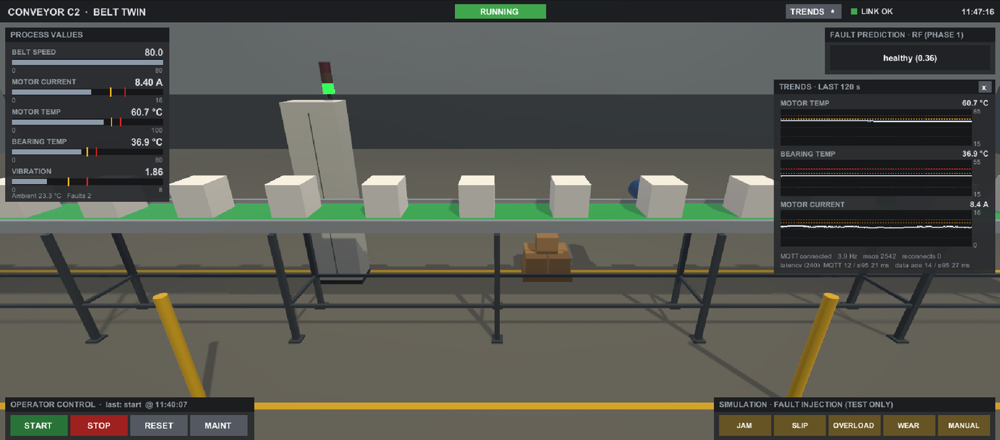
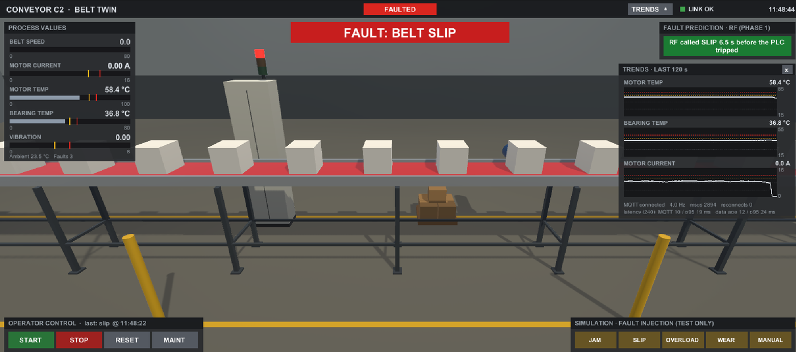
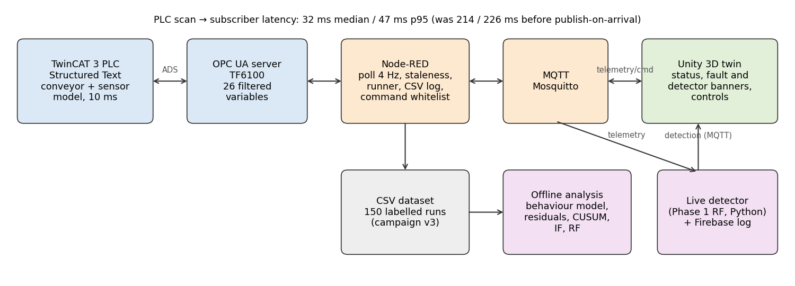
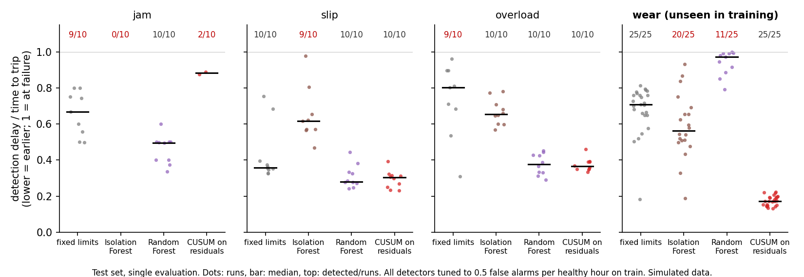
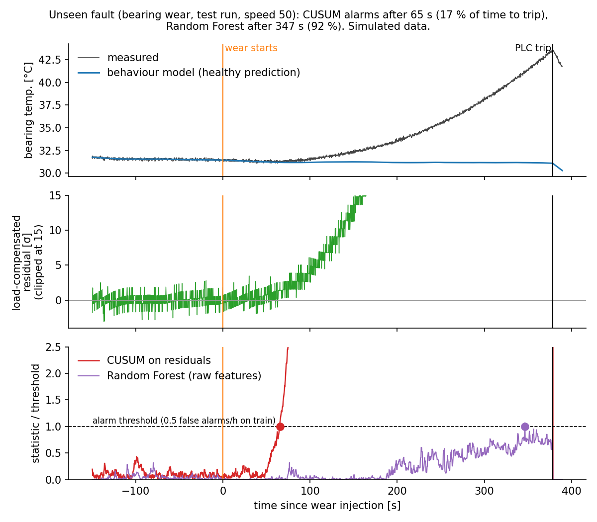

# BeltTwin: real-time digital twin and fault detection for an industrial conveyor

A TwinCAT 3 PLC simulates a conveyor with realistic sensors and injectable faults. Its data flows through OPC UA, Node-RED and MQTT into a Unity 3D twin and into Python fault detectors. Everything runs on one Windows PC. **All sensor data is simulated** by the PLC; there is no physical conveyor.

The project has two phases:
- **Phase 1:** the end-to-end pipeline, a labelled dataset and a live Random Forest fault detector shown in Unity.
- **Phase 2:** residual-based anomaly detection. A behaviour model of the healthy machine is identified from data, and four detectors are compared on a pre-registered test set, including a fault type that no detector saw during training.
- **Robustness check:** the conveyor was rebuilt from MATLAB Simscape library physics, and the whole evaluation was repeated on that independent plant model.



*The Unity twin while running: an operator HMI in the ISA-101 style (grey by default, colour only for abnormal states) over a procedurally built factory hall. The stack light on the cabinet follows the PLC state. The fault-prediction panel shows the Phase 1 Random Forest, which was trained on sensor model v2; on v3 data its confidence is low.*



*After a belt-slip injection: the PLC trips (red banner, red stack light, red belt), and the trends overlay shows the current dropping at the trip. In this run the live RF called SLIP 6.5 s before the trip. That is one demonstration, not evidence; the evaluated numbers are below.*



## Key results

| | Result |
|---|---|
| **Latency** | PLC scan → MQTT subscriber **32 ms median / 47 ms p95**, measured with the PLC's own clock. It was 214 / 226 ms until I traced 72 % of it to two unsynchronised Node-RED timers and switched to publish-on-arrival. |
| **Unseen fault** | On bearing wear, which was held out of all training and tuning, **CUSUM on load-compensated residuals detected 25 / 25 runs at a median 17 % of the time to failure**. A supervised Random Forest detected 11 / 25, at a median 97 %. Same false-alarm budget for all detectors. |
| **Known faults** | On jam, slip and overload, the Random Forest is as good as CUSUM or better: best on jam (10 / 10, 0.62 s), tied on slip and overload. CUSUM misses 8 of 10 jams: a jam trips in 1–4 s, faster than its spike-protected sum can grow. |
| **Independent physics** | On a Simscape plant model (library physics, own pre-registered split, evaluated once), **CUSUM again detected all 25 unseen wear runs, at a median 16 % of the time to failure**; the Random Forest detected none. The behaviour model needed a speed² term there, chosen from training data. |
| **Data collection** | 150 / 150 runs `ok` in a 25-hour unattended campaign, with every PLC write verified through counters. One of 250 writes was silently lost and automatically retried. A second campaign of 150 Simscape runs took 204 min. |



## Phase 2 in one picture

A wear run from the test set. The behaviour model predicts what the bearing temperature *should* be, given speed, ambient temperature and load. Wear shows up as a growing residual, and CUSUM alarms after 65 s. The Random Forest, trained only on other faults, reacts after 347 s, just before the PLC trips.



## How it works

**PLC (TwinCAT 3, Structured Text, 10 ms task).** A conveyor state machine with speed ramps, first-order thermal models for motor and bearing, and five injectable faults (jam, slip, overload, bearing wear, manual). Sensor model v3 adds the things that make detection hard:
- an unmeasured load disturbance (two Ornstein-Uhlenbeck processes);
- ambient temperature drift;
- belt creep;
- encoder and ADC quantisation;
- Gaussian noise with real tails (Box-Muller);
- rare impulsive spikes;
- randomised, accelerating fault onset.

The OPC UA symbol filter exposes 26 operational variables. The hidden fault severities are never published, so there is no label leakage. An inject counter lets the data collector verify every fault injection.

**Pipeline.**
- Node-RED polls OPC UA at 4 Hz and detects stale data from the PLC clock: a stopped PLC still answers reads, so its frozen values looked live until this check.
- It publishes JSON telemetry to MQTT and accepts commands only from a whitelist with range checks.
- A resumable scenario runner executes data campaigns unattended: thermal settling, randomised run order, verified writes, a per-run manifest.
- Unity subscribes over MQTT and shows the twin with an operator HMI (process-value bars with limits, on-demand trends, controls separated from fault injection), fault banners and detector verdicts, with automatic reconnect. Data age at the display is about 12 ms median.

**Behaviour model (Phase 2).**
- First-order output-error models for motor and bearing temperature, plus static maps for current, vibration and belt ratio.
- Identified only from the healthy segments of training runs. The data selected the model order: second order brought no improvement in cross-validation.
- The unmeasured load turned out to be visible in the current residual (correlation 0.985 with the motor-temperature residual). Using it as an auxiliary input cut the temperature residuals to the sensor noise floor: 1.63 → 0.087 °C for the motor, 0.215 → 0.085 °C for the bearing. Overload *is* extra load, so these load-compensated residuals are blind to it by construction; the current residual carries it instead.

**Detectors (Phase 2).**

| Detector | What it does |
|---|---|
| Fixed limits | Static limits on measured signals, like PLC alarms |
| CUSUM | Two-sided CUSUM on whitened residuals |
| Isolation Forest | Novelty detection on residual features |
| Random Forest | Supervised classifier on raw-signal features (the Phase 1 design) |

All four are tuned on training runs only, to the same budget of 0.5 false alarms per healthy hour.

**Evaluation protocol.**
- The train/test split was fixed and committed before any model was fitted: 75 / 75 runs, and all 25 wear runs in test.
- Residuals and model scores on training runs are out-of-fold.
- The test set was evaluated once. `ml/evaluate.py` stores a fingerprint of the frozen settings and refuses a second evaluation if they change.

## Robustness check: the same evaluation on Simscape physics

The Phase 2 result could be an artefact of a plant model written by the same person who designed the detectors. So the conveyor was rebuilt in MATLAB Simscape from library components, generated entirely by scripts in `simscape/`:

- **Drive:** a DC motor with its own thermal model (winding resistance rises with temperature), PI speed control, a 20:1 gear.
- **Belt:** driven by the drum through a friction clutch, which can slip.
- **Load and heat:** a random material load; the drum bearing heated by its own friction.
- **Faults:** the four faults as changes to physical parts: a braking force (jam), falling grip (slip), extra load (overload), extra bearing friction (wear).

Component parameters are assumed and calibrated to the PLC model's steady state (7.25 A, motor +30 K, bearing +10.5 K at speed 60). Vibration is not modelled.

| Bearing wear, unseen (25 test runs) | PLC model | Simscape |
|---|---|---|
| CUSUM on residuals | 25/25 at 17 % | **25/25 at 16 %** |
| Fixed limits | 25/25 at 71 % | 17/25 at 77 % |
| Isolation Forest | 20/25 at 56 % | 14/25 at 42 % |
| Random Forest | 11/25 at 97 % | 0/25 |

Fractions are median detection delay over time to failure.

What Simscape showed that the PLC model hid:

- **Energy conservation.** The PLC model heated a worn bearing without extra motor power; in Simscape the motor supplies it, slightly but measurably.
- **Slip has no signature** until the belt's grip breaks away, at about 90 % of the time to failure. Every detector is late on slip there.
- **Losses are not linear in speed** (bearing ∝ speed², copper ∝ current²). The linear behaviour model failed its acceptance check, and the training data selected a speed² term (bearing residual 0.31 → 0.086 °C).

Details: `tests.md` A15.

## Limitations

- **Simulated data.** I wrote the PLC simulator. The Simscape model uses library physics, but its component parameters are also mine. The wear result holds on both, partly because wear heats the bearing in any plausible physics. Real bearing degradation is messier. The *direction* of the result (residual methods generalise to unseen faults, supervised classifiers don't) is credible. The *size* of the advantage should not be read as a real-world number.
- **The behaviour model's structure did not transfer unchanged:** on Simscape it needed a speed² term, selected from training data.
- **Small samples:** 10 test runs per trained fault type, 25 wear runs, 9.9 healthy test hours. False-alarm rates have wide confidence intervals; the Random Forest reached 0.70 per hour on test (95 % CI 0.28–1.45).
- **The PLC trip fires on hidden fault severity:** it is the ground-truth failure event, not a realistic protection relay.
- **Each OPC UA variable is a separate read,** so one CSV row is not one PLC scan. Single-sample belt ratios are therefore noisy, and the detectors use a 2 s window.

## Reproducing Phase 2

The dataset (150 runs, about 7 MB zipped) is not in git. With it unpacked to `data/v3/`:

```
python ml/behaviour_model.py data/v3     # behaviour model + residuals (about 30 s)
python ml/detectors.py data/v3           # tune four detectors on train (about 2 min)
python ml/evaluate.py data/v3            # frozen detectors on the test set
```

Requires Python 3 with numpy, pandas, scipy, scikit-learn and joblib. The split (`ml/split_v3.csv`) is committed; `ml/make_split.py` refuses to overwrite it.

The Simscape check (MATLAB R2026b with Simulink, Simscape, Simscape Electrical and Simscape Driveline):

```
% in MATLAB, folder simscape/
build_conveyor_step5                 % build the parameterised model
run_simscape_campaign('full')        % 150 runs to data/simscape (about 3.5 h)
```
```
python ml/behaviour_model.py data/simscape --tag sim
python ml/detectors.py data/simscape --tag sim
python ml/evaluate.py data/simscape --tag sim
```

## Repository

| Path | Content |
|---|---|
| `BeltTwin/` | TwinCAT 3 solution (PLC project `BeltLogic`, `MAIN.TcPOU`) |
| `nodered/` | Node-RED flow; `scenario_runner.js` (campaign v3, Phase 2) and `scenario_runner_resumable.js` (Phase 1 campaign) |
| `ml/` | Phase 1 RF and live detector; Phase 2 behaviour model, detectors, evaluation, frozen settings and results |
| `simscape/` | MATLAB scripts that build the Simscape plant model step by step, and the campaign script |
| `docs/` | Figures |
| `tests.md` | Every measurement and result, with method and caveats |

The Unity project is in a separate repository, `BeltTwinUnity`.

**Stack:** TwinCAT 3 (Structured Text), OPC UA (TF6100), Node-RED, MQTT (Mosquitto), Unity (C#), Python (numpy, pandas, scipy, scikit-learn), MATLAB / Simulink / Simscape (Electrical, Driveline), Firebase.
